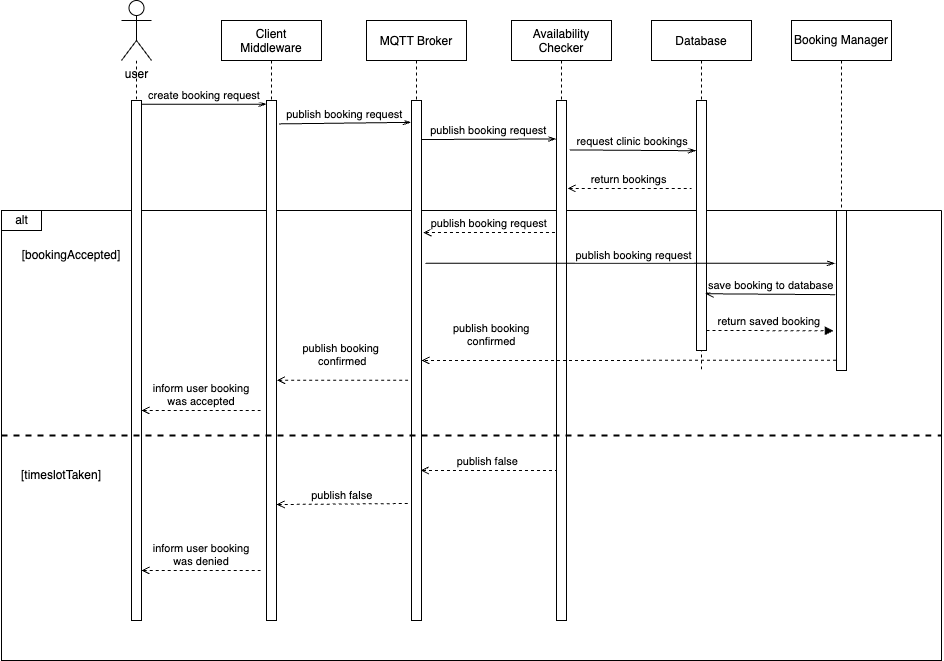

# Availability Checker Component for the Dentismo Web Application 

## Description
This component works in combination with other components of a distributed systems project to allow users of Dentismo, an online web application, to book appointments at dentist clinics. A user will attempt to book an appointment on the website. The request to book the appointment is then sent via an MQTT protocol from the client, through middleware and to the Availability Checker where we check the date and time against all other bookings at that specific clinic within the database. If the date and time is free, we will publish the booking request further to an MQTT topic which will then allow the subscribed Booking Manager component to complete the booking process. If the timeslot is unavailable or the booking request was somehow incomplete, we will again use the MQTT protocol to inform the client that the booking timeslot was either taken or the request had missing information. 

## Badges - TODO
On some READMEs, you may see small images that convey metadata, such as whether or not all the tests are passing for the project. You can use Shields to add some to your README. Many services also have instructions for adding a badge.

## Visuals
### Sequence Diagram
The sequence diagram represents a use case in which a user attempts to book an appointment. The alt case shows what happens in the event a booking is accepted or denied.


## Installation
1. Clone Repository
2. Via the terminal navigate to the cloned repository
3. Install and run Mosquitto in terminal
4. Run ```npm i``` to download all required packages for running the app
5. Run ```npm start dev``` to run the component
6. Open the Client Dentismo Website and create bookings

## Usage
The Availability Checker component is subscribed to the topic 'request/availability/+'

When a booking request is recieved, the JSON object will be validated to ensure we are recieving a complete request.
A complete booking request follows the format below:

```
{
    email: 'JoshJ@gmail.com',
    name: 'Josh Joshsson',
    clinicId: '1',
    issuance: '858954984',
    date: '2023-01-17',
    state: 'pending',
    start: 'Tue Jan 17 2023 08:30:00 GMT+0100 (Central European Standard Time)',
    end: 'Tue Jan 17 2023 09:00:00 GMT+0100 (Central European Standard Time)',
    details: 'Booking details'
}
```

In the event of a validation error, an array of error strings will be returned. For example, if the clinicId is missing and the email is not valid, the Availability Checker will publish to 'reponse/createBooking':

```
[
'email: must be a valid email', 'clinicId: missing'
]
```

Assuming the booking request was validated, it will then be compared against the bookings in the database to see if there are conflicts for the selected timeslot. If there are no conflicts, the booking request will be published to 'request/create-booking' so that the booking manager may complete the booking by saving the booking to the database.

```
{
  accepted: true,
  booking: {
    email: 'JoshJ@gmail.com',
    name: 'Josh Joshsson',
    clinicId: '1',
    issuance: '858954984',
    date: '2023-01-17',
    state: 'pending',
    start: 'Tue Jan 17 2023 08:30:00 GMT+0100 (Central European Standard Time)',
    end: 'Tue Jan 17 2023 09:00:00 GMT+0100 (Central European Standard Time)',
    details: 'Booking details'
    }
}
```

Otherwise, a message is published to 'reponse/create-booking' which informs the client that the booking slot was already taken.

```
{
"accepted": "false"
}
```

## Support
John Webb - muse#6181 on Discord

Bardia Forooraghi - Bardia#4805 on Discord

## Roadmap
No established roadmap is in place at this time.

## Contributing
As this is a graded university project, we will not permit any contributions from those outside of the group.
Any contributions must be approved by the maintainer.

## Authors and acknowledgment
-   The contributors to the Availability Checker Component include:

    **Bardia Forooraghi**
    - Contributed to creating logic for checking availability of booking requests which can be seen in Controller.js

    **John Webb**
    - Contributed to creating logic for checking availability of booking requests which can be seen in Controller.js

    - Made validation method for validating the JSON of incoming booking requests published to the 'request/createBooking' topic

    **Georg Zsolnai**
    - Added CI/CD 

The other project team members consist of: Carl Dahlqvist, Ivan Vidanovic, Ansis Plepis and Daniel Dovhun. 

## License - TODO
For open source projects, say how it is licensed.

## Project status
The Availability Checker is completed. Thus this repository will not recieve any additional changes for the time-being. We have completed the other components that are part of the greater Dentismo distributed system. In the next few weeks, we will be connecting the backend to the frontend, as well as establishing tests to make sure everything is performing as intended. We aim to have the greater Dentismo project completed by the 16th of December, 2022. 
